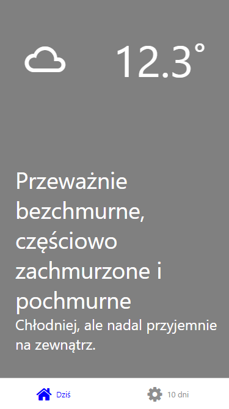

# YAEA
> Yet Another Expo App

Pogodynka, aplikacja pobier akutalną lokazlizację użądzenia, na podstawie kordynatów pobiera pogodę dla danego dnia i sugeruje czy powinniśmy dziś wziąć parasol czy moze butelkę wody.

Dostepny jest równiez podlgąd pogody dla 10 dni.

## Android app

https://github.com/devchew/yaep/releases
w releases dostępne są pliki .apk
